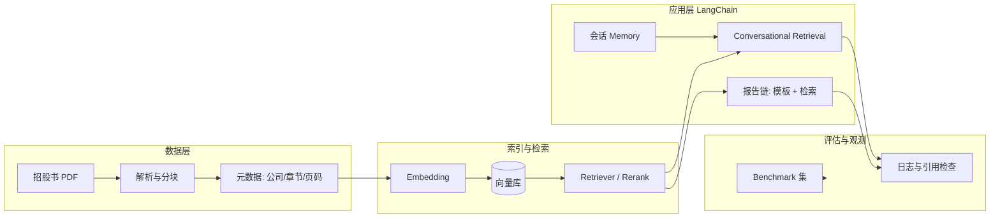

# IPO 打新 RAG 助手 — 设计文档

## 1. 项目目标与边界

### 1.1 目标

- 基于**招股书等公开材料**（以 PDF 为主），用 **RAG** 支撑两类能力：
  - **报告模式**：按模板生成结构化分析（业务、财务与估值、风险、打新相关信息、**IPO 综合分 0～10** 等），细则见 **§1.2**。
  - **多轮对话模式**：针对同一份或多份材料追问细节、对比、迭代改稿。
- 输出以**可引用的事实**为主（章节/页码），结论表述为**信息整理与风险提示**，**不构成投资建议**（产品层需保留免责声明）。

### 1.2 报告模式：结构化模板与 IPO 综合分（0–10）

报告模式除按章节输出分析外，须给出 **IPO 综合分（0～10 分，保留一位小数）**。该分数由 **两个维度各 50% 加权** 得到；任一维度因招股书未披露而无法打分时，须**显式说明缺失项**，综合分可标为「部分可算」或仅输出可算子分。

#### 1.2.1 报告正文建议结构（ headings 级）

| 章节 | 内容要点 | 引用要求 |
|------|----------|----------|
| 公司与本次发行 | 名称、上市地、板块、保荐人、募资用途摘要、时间表（若披露） | 页码/章节 |
| 业务与行业 | 商业模式、产品/服务、收入结构、下游客户与集中度、竞争格局 | 同上 |
| 行业地位与前景 | 细分赛道规模、增速、公司在行业中的**排名/份额**（若披露）；与可比公司的定性对比 | 同上 |
| 财务与盈利能力 | 营收/净利/毛利率/净利率/ROE 等趋势；盈利是否稳定、是否依赖非经常性损益 | 同上 |
| 估值与发行条款 | 招股价区间、市值区间、**发行市盈率/市销率**等（以招股书披露为准） | 同上 |
| 风险因素 | 摘录或归纳招股书「风险因素」中与业务、监管、客户、财务相关要点 | 同上 |
| 打新相关信息 | 见下节「投机维度」字段：融资/估值倍数、基石、绿鞋、回拨等 | 同上 |
| IPO 综合分 | **基本面分（/10）**、**投机维度分（/10）**、**加权综合分（/10）** 及简要理由 | 子分项可简述依据 |

免责声明：综合分为**基于公开材料的启发式整理**，不代表申购建议或收益承诺。

#### 1.2.2 基本面维度（权重 50%，子分 0～10）

用于回答：这家公司**值不值得从生意与报表角度细看**。建议从下列子项综合给分（不必机械公式，但须在报告中用短列表说明**扣分/加分理由**）：

| 考察项 | 说明 |
|--------|------|
| 商业模式与业务逻辑 | 收入是否可持续、是否单一依赖、护城河表述是否与数据一致 |
| 行业与前景 | 赛道空间、政策与周期、招股书对行业增速的引用是否合理 |
| 行业地位 | **市场份额、排名、与头部差距**（仅基于招股书及引用来源；未披露则降权并写明） |
| 盈利能力 | 利润率趋势、盈利质量、异常项目；亏损企业则看亏损收窄逻辑与现金消耗 |

**子分标度（建议）**：8–10 强、5–7 中、0–4 弱；「未披露过多」整体不超过 6 分除非其余极强。

#### 1.2.3 投机 / 打新维度（权重 50%，子分 0～10）

用于回答：**从配售结构、估值倍数与回拨规则看，短线博弈特征偏正面还是偏负面**。建议子项如下（均须标注招股书页码或「未披露」）：

| 考察项 | 计分逻辑（原则） |
|--------|------------------|
| **融资/发行估值倍数** | 以招股书披露的 **发行市盈率（或主表同一口径的估值倍数）** 分档计分。分档示例（可按市场习惯微调，但须在 `prompts.md` 或配置中写死一版）：**≥1000** 为最高档（投机博弈空间大）；**100～400（含边界按产品定义）** 为中档；**&lt;100** 为较低档。档内再按「倍数越高越好」微调 1～2 分。若招股书未披露可比的发行市盈率，本项记「无法打分」并扣减本维度上限。 |
| **基石投资者** | **基石占全球发售股份比例**（或招股书等价指标）：比例高 → 通常视为发行定价有长线背书，**正向**；无基石或比例极低 → **偏负向或中性偏负**（按披露分段给分）。 |
| **绿鞋（超额配售权）** | **有绿鞋** → 短期供给调节工具更完备，**偏正向**；**无** → 中性或略负向（视其他项）。 |
| **回拨机制与散户占比** | 港股常见：公开发售超购触发**回拨**，回拨比例**高**则**散户获配占比上升**，筹码偏散，短线波动与一致性砸盘风险上升，记为 **负向**；回拨比例低、国配占比高 → **偏正向**。需在报告中写出触发档位与回拨比例（若披露）。 |

**投机维度子分**：将上表各项按团队约定权重合成 0～10（例如：估值倍数 40%、基石 25%、绿鞋 15%、回拨 20%），权重可配置；须在报告中列出**合成方式简述**。

#### 1.2.4 综合分计算

\[
\text{IPO 综合分} = 0.5 \times \text{基本面子分} + 0.5 \times \text{投机维度子分}
\]

若某一维度缺失：仅输出另一维度子分，综合分标注 **「仅单维度可评」**，不得用另一维度翻倍凑满 10 分。

#### 1.2.5 参考材料

若团队有**成文的打分范例或行业解读**（例如一篇公众号/研报风格的 IPO 分析），可放入 `docs/` 或附录，并在 `chains/prompts.py` 中作为 **few-shot 或风格参考**；**不得**将未授权全文写入仓库对外分发。

### 1.3 非目标（v1）

- 不承诺替代持牌投顾；不保证覆盖所有市场实时行情（若接入外部数据，需标明来源与时效）。
- 不默认使用 multi-agent；单管线 RAG + 对话稳定后再考虑拆分角色。

### 1.4 技术选型与协作约定

本仓库中凡涉及 **Embedding、向量库、分块策略、检索增强、模型供应商、评测方案** 等，**均应在变更前与产品/负责人对齐**；本文档用下列标签区分状态，避免「静默替团队做主」：

| 标签 | 含义 |
|------|------|
| **【已落地】** | 当前代码已实现，与 `src/` 一致；若需调整，按 issue/评审修改。 |
| **【待评审】** | 方案已写入设计，但参数或供应商未最终拍板，**实施前需讨论**。 |
| **【未来实现】** | 规划能力，**尚未排期或未写代码**；以 §6 里程碑与 issue 跟踪。 |

**原则**：重大选型（换 embedding、换向量库、上语义切分、引入外搜/行情 API）应至少有 **一次书面结论**（本 DESIGN 或 PR 说明），并尽量用 **benchmarks** 或对比实验支撑。

---

## 2. 系统架构（建议）

整体分为：**数据层 → 索引与检索 → 应用层（报告 / 多轮）→ 可选评估与观测**。



### 2.1 数据流简述

1. **Ingestion**：PDF → 文本（含表格策略）→ 分块 → 每条 chunk 带 `doc_id`、`page`、`section` 等元数据。
2. **Indexing**：Embedding 写入向量库；可按「单公司一库」或「多公司共享库 + 过滤」设计。
3. **Query**：多轮场景下先做 **standalone question**（把指代补全），再检索；可选 **rerank**。
4. **Generation**：模板或对话 prompt 要求**引用来源**；缺失时写「材料未披露」而非编造。

### 2.2 技术栈（与当前共识一致）

- **编排与对话**：LangChain（Memory + Conversational Retrieval + 可选 Tools）。
- **模型与向量**：按环境选择 OpenAI 兼容 API / 本地模型；向量库如 Chroma、FAISS、或 PG + pgvector。
- **服务形态**：可先 **CLI + 本地运行**，再拆 **FastAPI** 等 API，前端可选。

### 2.3 和 LangChain「官方架构」的关系（重要）

**LangChain 并不规定你的仓库目录长什么样**——它是库（`pip install`），不是像某些框架那样强制 `app/`、`controllers/`。  
`DESIGN.md` 里的目录是**按业务模块拆分**的工程习惯，方便维护；实现时在对应目录里 **import 并组装 LangChain 的组件**即可。

他们家（含周边）常被提到的几块，和本项目的对应关系如下：

| LangChain 侧核心概念 | 大致作用 | 在本仓库中的落点 |
|----------------------|----------|-------------------|
| **Document Loaders** | 读 PDF/网页等成 `Document` | `ingestion/pdf_loader.py`（可直接或封装 `langchain_community.document_loaders`） |
| **Text Splitters** | 分块、保留元数据 | `ingestion/chunking.py` |
| **Embeddings** | 文本 → 向量 | `index/embeddings.py`（如 `langchain_openai.OpenAIEmbeddings`） |
| **Vector Stores** | 存向量、相似度检索 | `index/vector_store.py`（如 Chroma、FAISS 等集成） |
| **Retriever** | 对向量库等的查询抽象 | `index/retriever.py` |
| **Chat Models / LLMs** | 对话与生成 | `chains/` 里构造，或 `config.py` 统一工厂方法 |
| **Prompts / ChatPromptTemplate** | 模板与变量 | `chains/prompts.py` |
| **Chains / LCEL（Runnable）** | 多步编排、`|` 管道 | `chains/report_chain.py`、`chains/chat_chain.py` |
| **Memory** | 多轮历史 | `memory/session_store.py` + LangChain 的 `BaseChatMessageHistory` 等 |
| **RAG 模式** | 检索 + 生成 | ConversationalRetrievalChain、或 LCEL 手写 `retrieve \| generate` |
| **Agents & Tools**（可选） | 工具调用、多步推理 | v1 可空；日后接行情 API 等再放 `tools/` |
| **LangGraph**（可选） | 有状态图、复杂分支 | 仅在流程变复杂时考虑，不是目录必备 |

**小结**：目录结构是**工程分层**；LangChain 要求的是你在代码里**正确组合 Runnable、Retriever、Memory、Model**，二者是「文件夹怎么分」vs「运行时怎么连」两层事。若你希望目录名和官方术语完全一致，也可以把 `chains/` 改成 `runnables/` 之类，但社区里叫 `chains/` 或 `pipelines/` 都很常见。

---

## 3. 建议代码目录结构

以下为 **Python 单体仓库** 的参考布局；可按实际删减。

```text
ipo-rag-assistant/
├── README.md
├── DESIGN.md                 # 本设计文档
├── pyproject.toml            # 或 requirements.txt
├── .env.example              # API Key、向量库路径等（勿提交真实密钥）
│
├── src/
│   ├── __init__.py
│   ├── config.py             # 配置与环境变量
│   │
│   ├── ingestion/            # 数据接入与解析
│   │   ├── __init__.py
│   │   ├── pdf_loader.py     # PDF 读取
│   │   ├── chunking.py       # 分块策略与元数据注入
│   │   └── pipeline.py       # 单文件/批量入库入口
│   │
│   ├── index/                # 索引与向量存储
│   │   ├── __init__.py
│   │   ├── embeddings.py     # Embedding 封装
│   │   ├── vector_store.py   # 建库、增删查
│   │   └── retriever.py      # Retriever + 可选 rerank
│   │
│   ├── chains/               # LangChain 链
│   │   ├── __init__.py
│   │   ├── report_chain.py   # 报告模板 + 检索 + 生成
│   │   ├── chat_chain.py     # 多轮 + Conversational Retrieval
│   │   └── prompts.py        # Prompt 模板集中管理
│   │
│   ├── memory/               # 会话（可选独立包）
│   │   └── session_store.py  # 内存 / Redis / 文件
│   │
│   ├── api/                  # 若提供 HTTP 服务
│   │   └── main.py           # FastAPI 路由：上传、对话、生成报告
│   │
│   └── cli/                  # 命令行入口
│       └── main.py
│
├── benchmarks/               # 评测集与脚本（见 §5，尤其 §5.0 当前实现）
│   ├── README.md
│   ├── gold_qa.jsonl         # 人工标注：问题 + 期望页码/关键句
│   └── run_eval.py           # 跑检索与忠实度指标
│
├── data/
│   ├── raw/                  # 原始 PDF（可 gitignore）
│   └── processed/            # 可选：中间 json
│
└── tests/
    └── ...
```

### 3.1 各目录职责说明

| 路径 | 作用 |
|------|------|
| `ingestion/` | 把招股书变成「带元数据的文本块」；质量直接影响 RAG 上限。 |
| `index/` | Embedding、向量库、Retriever；与具体业务解耦，便于换模型或换库。 |
| `chains/` | LangChain 业务逻辑：报告链、对话链、prompt；尽量少写与框架无关的重复代码。 |
| `memory/` | 多轮会话的存取；与 `chat_chain` 配合。 |
| `api/` / `cli/` | 对外入口；薄层，主要调 `chains` + `index`。 |
| `benchmarks/` | **离线评测**：小黄金集 + 自动化脚本，不替代人工抽查。 |
| `data/` | 本地 PDF 与可选中间产物；大文件建议 `.gitignore`。 |

---

## 4. 各模块可选技术与选型

以下为 **常见选项 + 怎么选**，便于 v1 快速落地、后续替换组件。原则：**先跑通再优化**；**embedding 与向量库尽量可插拔**（同一接口换实现）。

### 4.1 `ingestion/` — PDF 与解析

| 技术 | 特点 | 适用 |
|------|------|------|
| **PyMuPDF (`fitz`)** | 快、依赖少，可拿每页文本与坐标 | 电子版 PDF、以文本层为主时优先 |
| **pypdf** | 轻量、纯 Python | 简单文本抽取 |
| **pdfplumber** | 表格、版面友好 | 财务表多、要对齐表格时 |
| **Unstructured** | 管道化、多格式 | 想统一多种文档源、接受更重依赖 |
| **OCR（如 Tesseract / 云 OCR）** | 扫描件可读 | 仅当招股书是扫描版；成本高、要校对 |

**选择建议**：先试 **PyMuPDF 或 pypdf** 出全文；若表格乱再 **pdfplumber** 补一条路径。招股书多为电子稿，**不必默认上 OCR**。

### 4.2 `ingestion/chunking` — 分块

#### 4.2.1 【已落地】当前实现（与代码一致）

- **技术**：LangChain **`RecursiveCharacterTextSplitter`**（递归字符切分）。
- **参数**：`chunk_size` / `chunk_overlap` 默认来自环境变量 `IPO_CHUNK_SIZE`（默认 900）、`IPO_CHUNK_OVERLAP`（默认 120），见 `src/ipo_rag/ingestion/chunking.py`。
- **分隔符**：`\n\n`、`\n`、`。`、`；`、`，`、空格等，优先在自然断点断开。
- **元数据**：PDF 先按**页**载入 `Document`，再 `split_documents`，子块继承 `page` 等字段，便于引用与评测。

> 上述为 v1 脚手架选型，**并非**经与你逐项确认后的终稿；若评审结论变更，以 issue + 本段更新为准。

#### 4.2.2 语义切分是否「更适合」本应用？（【待评审】结论区）

招股书是**长文档、章节多、表格与正文混排**，用户问题多为**事实型检索**（数字、风险、条款）。语义切分（按向量相似度或 LLM 找「主题边界」再切块）的利弊可概括如下：

| 维度 | 递归字符切分（当前） | 语义 / 主题切分（常见实现） |
|------|----------------------|-----------------------------|
| 实现与成本 | 低；无额外 embedding 调用 | 较高；往往需对片段或句子先算向量/调用模型 |
| 块内主题一致性 | 可能在句中切断，主题略散 | 通常**单块主题更纯**，对「抽象问题」检索有时更好 |
| 页码与合规引用 | 与按页元数据配合直观 | 边界可能跨页，**需额外规则**保证引用仍可对齐页码 |
| 表格与数字密集段 | 可能把表切碎 | 若与「结构感知」结合可改进，但依赖解析质量 |

**讨论结论（待你确认后可将本句改为终稿）**：

- 本应用**不必然**「更适合」语义切分：若当前瓶颈是 **Recall@k 偏低**，可优先试 **调 chunk、rerank、hybrid**，再与 **语义切分或按标题切分** 做 A/B。
- 若瓶颈是 **跨段落归纳类问题**（需一整节语义），语义切分或 **结构感知（目录）切分**更值得试点，并应用 **【未来实现】** 路径落地与评测。

#### 4.2.3 【未来实现】可选能力（未在 v1 代码中保证存在）

| 能力 | 说明 |
|------|------|
| **语义切分**（Semantic chunking） | 按语义边界合并/切分；需定义 breakpoint 策略与与 `page` 的映射策略。 |
| **按页优先 / 硬分页** | 强依赖页码展示时，限制单页内再分子块或按页检索。 |
| **结构感知**（目录/标题层级） | 依赖 PDF 解析抽出稳定标题；港股/A 股版式不同需分别验证。 |
| **tiktoken 对齐** | 若按 **token** 而非字符控长，可换 `length_function` 或 LangChain 的 token splitter。 |

**【待评审】**：从上述项中选 1～2 个做 PoC 时，应约定 **对比指标**（见 §5）与 **是否重建索引**。

### 4.3 `index/embeddings` — 向量模型

| 技术 | 特点 | 适用 |
|------|------|------|
| **OpenAI `text-embedding-3-small/large`** | 效果好、省心、付费 | 有预算、云端可接受 |
| **Cohere / Voyage 等** | 各家长文本、检索向量化 | 有现成账号、要做对比实验 |
| **开源本地**（**BGE**、**E5**、sentence-transformers） | 数据不出机、成本低 | 隐私要求高、可接受 GPU/CPU 延迟 |
| **多语言** | 中英文混合招股书 | 选声明支持 zh/en 的模型；**中英混合**可试 bge-m3 等 |

**选择建议**：开发期用 **云端小 embedding** 快速迭代；定型后若数据敏感再换 **本地 BGE 类**。**同一项目内不要混用不同 embedding 维度的库**（换模型要重建索引）。

### 4.4 `index/vector_store` — 向量库

| 技术 | 特点 | 适用 |
|------|------|------|
| **Chroma** | 本地嵌入式、上手快 | **单机原型、个人项目首选** |
| **FAISS** | 快、库成熟、无服务 | 纯本地、自己管持久化路径 |
| **LanceDB** | 嵌入式、可云存储 | 需要简单持久化 + 列存习惯 |
| **Qdrant / Milvus / Weaviate** | 服务化、可扩展 | 要上生产、多用户并发 |
| **PostgreSQL + pgvector** | 与业务库同栈 | 已有 PG、要事务与 SQL |

**选择建议**：v1 **Chroma 或 FAISS**；预期要上线多用户再 **Qdrant/pgvector**。

### 4.5 `index/retriever` — 检索增强

| 技术 | 特点 | 适用 |
|------|------|------|
| **相似度 Top-k** | 基线 | 默认 |
| **MMR** | 降低冗余片段 | 检索结果重复段落多时 |
| **Multi-Query Retriever** | 多查询合并召回 | 问法变化大、单 query 召回差 |
| **Rerank（Cross-Encoder / Cohere Rerank）** | 精排，**常比换 embedding 更划算** | benchmark 瓶颈在「准度」时加 |
| **Hybrid**（稀疏 BM25 + 稠密向量） | 专有名词、数字命中好 | 中英专有名词多时可试（需额外索引） |

**选择建议**：先 **Top-k + 可选 MMR**；黄金集分数卡住时再加 **rerank**，最后才考虑 hybrid。

### 4.6 `chains/` — 模型与编排

| 技术 | 特点 | 适用 |
|------|------|------|
| **ChatOpenAI / AzureOpenAI** | 生态好、工具多 | 默认云端方案 |
| **Anthropic Claude** | 长上下文、长文 | 招股书超长、希望少切分时 |
| **本地 Ollama / vLLM** | 离线 | 无 API、实验 |
| **LCEL（Runnable + `\|`）** | 当前 LangChain 推荐写法 | **新代码优先** |
| **ConversationalRetrievalChain**（旧） | 一站式多轮 RAG | 能快速原型；长期可迁 LCEL |

**选择建议**：**长招股书**可优先 **长上下文模型** 减少「漏切分」焦虑，但仍要 **RAG + 引用**，不能全靠上下文硬塞。

### 4.7 `memory/` — 多轮会话

| 技术 | 特点 | 适用 |
|------|------|------|
| **内存 `ChatMessageHistory`** | 重启丢 | 本地 CLI |
| **Redis** | 快、TTL | Web 多实例共享会话 |
| **PostgreSQL / SQLite** | 持久、可查 | 要审计、会话复盘 |
| **摘要记忆**（summary buffer） | 控制 token | 对话轮数多时 |

**选择建议**：先 **内存**；上 **FastAPI + 多进程** 后换 **Redis 或 DB**。

### 4.8 `api/` — HTTP 服务

| 技术 | 特点 |
|------|------|
| **FastAPI** | 异步、类型提示、OpenAPI，**Python 首选** |
| **Streamlit / Gradio** | 极快 UI 原型 | 内部 demo，非严肃 API |

### 4.9 `benchmarks/` — 评估工具（可选）

| 技术 | 特点 |
|------|------|
| **自写脚本**（Recall@k、页码命中） | 轻量、完全可控，**与招股书页码强绑定时推荐** |
| **Ragas** | RAG 指标封装（忠实度、上下文召回等） | 快速对齐业界指标；需接 LLM 评委时注意成本 |
| **DeepEval / TruLens 等** | 类似，偏可观测 | 团队已有选型可接入 |

**选择建议**：**页码级黄金集**优先自写检索指标；忠实度可 **规则 + 抽样 LLM judge**，再视需要接 Ragas。

### 4.10 汇总：选型决策顺序（实操）

1. **PDF**：电子稿 → PyMuPDF/pypdf；表多 → 加 pdfplumber。  
2. **分块**：递归 + overlap + `page` 元数据。  
3. **Embedding + 向量库**：开发期 **OpenAI embedding + Chroma**。  
4. **检索**：Top-k → MMR → **rerank**。  
5. **对话**：LangChain **LCEL + Memory + conversational retrieve**；追问用 **standalone question** 步。  
6. **上线前**：再评估 **数据是否出域**、是否换 **本地 embedding**、向量库是否迁 **PG/Qdrant**。

### 4.11 各模块技术选型：与负责人对齐的检查项（【待评审】）

以下与 §4.1～§4.9 选项表对应，**变更前建议逐项确认**，避免静默改栈：

| 模块 | 当前 v1 典型选择（见上文各节） | 讨论要点 |
|------|--------------------------------|----------|
| PDF 解析 | pypdf | 是否需 **pdfplumber / PyMuPDF** 补表格与版式。 |
| 分块 | 递归字符 + overlap | 是否试点 **语义/结构切分**（§4.2.3）。 |
| Embedding | OpenAI `text-embedding-3-small` | 成本、数据出境、是否换 **本地 BGE** 等。 |
| 向量库 | Chroma 本地 | 单机够用否；是否迁 **PGVector / Qdrant**。 |
| 检索 | Top-k | 何时上 **MMR / rerank / hybrid**（与 benchmark 联动）。 |
| 对话模型 | `gpt-4o-mini` 等 | 长文档、成本、是否换 **Claude** 等。 |
| 会话存储 | 进程内 Memory | 上 Web 后是否 **Redis / DB**。 |
| API | 未实现，CLI 为主 | 是否 **FastAPI**、鉴权与上传大小限制。 |
| 评测 | 页码 Recall@k | 何时加 **忠实度、报告完整性、Ragas**（§5.0）。 |

新增外部能力（行情 API、主动拉招股书、外搜）须单独 **【未来实现】** 条目 + 合规评审。

---

## 5. Benchmark 是什么、评什么

这里的 **Benchmark** 指：**用固定数据集与指标，离线衡量「检索是否找对」和「生成是否忠于材料」**，用于迭代分块、检索策略和 prompt，而不是预测股价。

### 5.0 【已落地】vs【未来实现】：当前仓库里到底有什么

| 状态 | 内容 |
|------|------|
| **【已落地】** | **`benchmarks/gold_qa.jsonl`**：人工维护的 JSONL，字段至少含 `question`、`gold_pages`（期望答案所在页，与 `metadata.page` 一致）。 |
| **【已落地】** | **CLI `ipo-rag eval`**（及 `benchmarks/run_eval.py` 转调）：对每条问题跑 **Retriever**，看 **top-k 检索结果中是否出现任一 `gold_pages` 中的页码**，输出命中率；k 由 `IPO_TOP_K` 控制（默认 6）。即当前 benchmark **实质是「检索 Recall@k（页码是否命中）」**，**尚未**自动评测生成忠实度或报告完整性。 |
| **【未来实现】** | **忠实度（Faithfulness）**：答案句是否被检索上下文支持；可规则脚注 + 抽样 LLM-as-judge，或接 **Ragas** 等（见原 §4.9）。 |
| **【未来实现】** | **报告完整性**：对报告模式检查必填章节是否非空、「未披露」是否显式写出。 |
| **【未来实现】** | **MRR、nDCG** 等排序指标：若黄金集扩展到「关键句级」可再加。 |
| **【待评审】** | 黄金题数量、是否按 `prospectus_id` 分文件、是否引入 `dev/test` 划分防泄漏。 |

**小结**：当前 benchmark **只覆盖「检索是否捞对页」**；与「模型生成是否胡说」相关的指标 **仍属规划**，需在迭代分块/换 embedding 时同步补齐，否则易只看召回、忽略忠实度。

### 5.1 建议三类指标（含未实现项标注）

| 类型 | 含义 | 常见做法 | 实现状态 |
|------|------|----------|----------|
| **检索** | 相关问题能否召回含答案的 chunk | 人工建 20～100 条 `(问题, 招股书标识)`，标出**应命中的页码或关键句**；算 Recall@k、MRR。 | **【已落地】** 页码 Recall@k（CLI `eval`）；MRR 等 **【未来实现】** |
| **忠实度（Faithfulness）** | 回答句是否被检索上下文支持 | 规则：强制脚注；或 LLM-as-judge 判断「claim 是否被 context 蕴含」（需防评委偏差）。 | **【未来实现】** |
| **完整性（报告）** | 模板章节是否覆盖 | Schema / 检查清单：必填小节是否非空；「未披露」是否显式写出。 | **【未来实现】** |

### 5.2 数据集长什么样（示例）

`benchmarks/gold_qa.jsonl` 每行一条 JSON，例如：

```json
{
  "prospectus_id": "hk_1234_2024",
  "question": "前五大客户收入占比是多少？",
  "gold_pages": [142, 143],
  "gold_snippet_hint": "五大客户",
  "split": "dev"
}
```

脚本 `run_eval.py`：对每条 question 跑检索，看 gold 页是否落在 top-k chunk 的页码集合里；可选再跑完整生成并打忠实度。

### 5.3 基线（Baselines）

迭代时对比：

- **基线 A**：仅全文关键词 / 无向量检索（若有）。
- **基线 B**：向量检索 + 固定分块。
- **基线 B + 改写**：standalone question + 检索。
- **基线 B + rerank**：在 B 上加 cross-encoder 等。

目标不是绝对分数，而是 **同一套 gold 集上，改动分块/检索/prompt 后指标是否一致提升**。

### 5.4 与「线上质量」的关系

- Benchmark **不保证**用户体验满分；需保留 **少量真实会话的人工抽查**。
- 招股书更新或换市场时，应 **增量补充** gold 题，避免过拟合旧模板。

---

## 6. 实施顺序（回顾）

1. 单份招股书：PDF → 分块 → 向量库 → 单轮问答 + 引用。  
2. 接入 LangChain：Memory + Conversational Retrieval + 报告链。  
3. 建立 `benchmarks/` 最小黄金集与 `run_eval.py`。  
4. 再考虑 API、多文档、外部行情工具等。

---

## 7. 变更记录

| 日期 | 说明 |
|------|------|
| 2026-04-01 | 初版：设计思路、架构、目录、benchmark 定义 |
| 2026-04-01 | 补充 §2.3：LangChain 核心概念与目录对应（非官方目录要求） |
| 2026-04-01 | 新增 §4：各模块可选技术与选型（含决策顺序） |
| 2026-04-12 | 新增 §1.4 技术选型协作约定；扩展 §4.2 已落地/语义切分讨论/未来分块；§4.11 全模块选型对齐检查项；§5.0 当前 benchmark 与规划；§5.1 增加实现状态列 |
